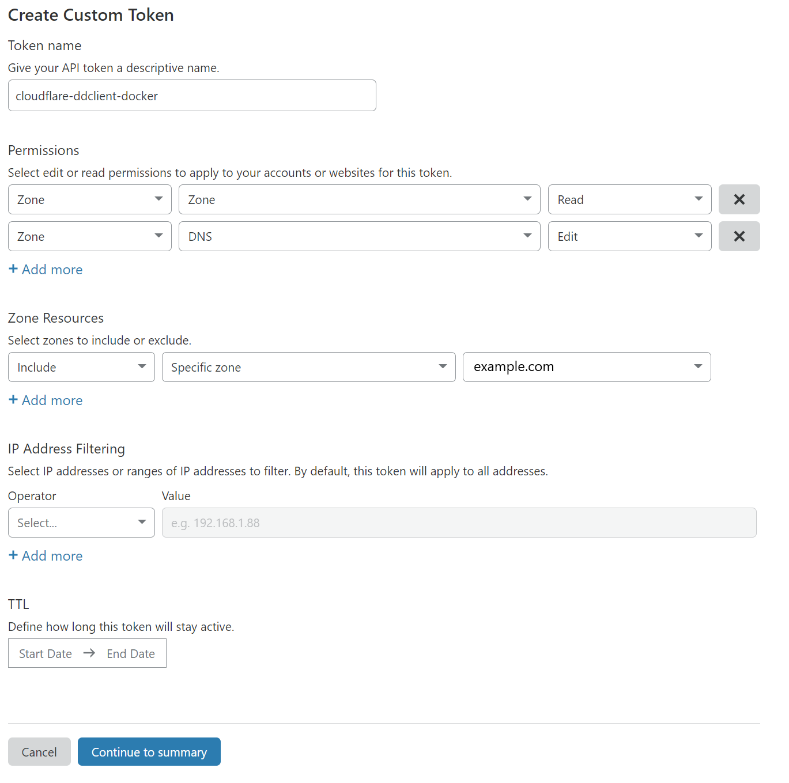

# cloudflare-ddclient-docker

This container enables you to use a domain or subdomain on cloudflare to be used as a dynamic dns service.

## Setup

### Create the environment file

- Copy the `.env.example` file to `.env`

- Enter your `DOMAIN` in the `.env` file. Domains and subdomains will work `example.com` or `sub.example.com`

### Create a custom token

- Add these two permissions:

  ||||
  |-|-|-|
  |Zone|Zone|Read|
  |Zone|DNS|Edit|

- Include the specific zone

- Create the token and copy it into the `.env` file

## Config

You can configure the refresh interval if you add a `INTERVAL` variable to the environment file (e.g. `INTERVAL=600`). Default `INTERVAL` is 300sec = 5min.
